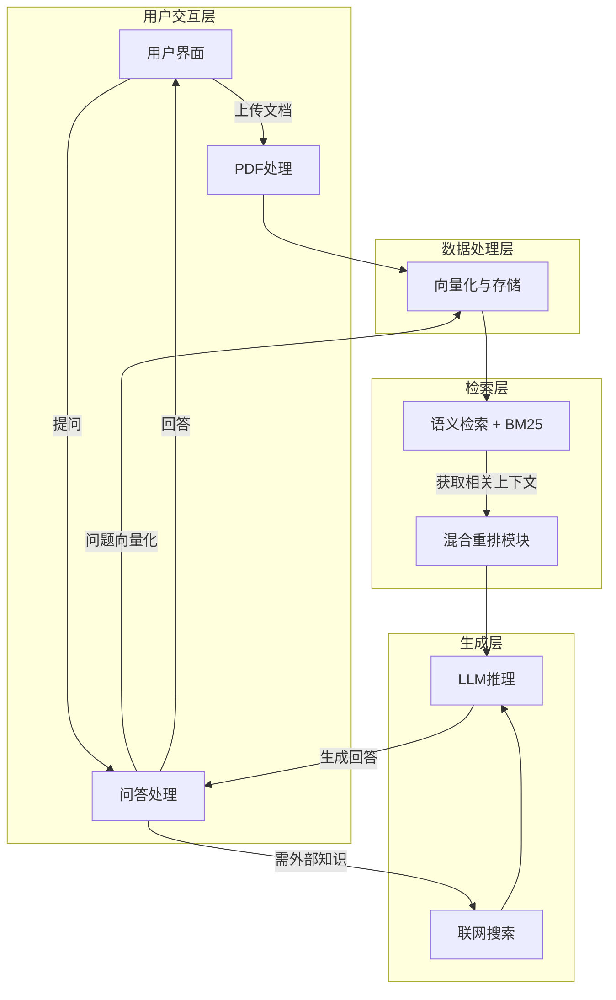

<div align="center">
<h1>📚 本地化智能问答系统 (FAISS版)</h1>
<p>


</p>
</div>

## 🎯 核心学习目标

本项目旨在为希望深入理解RAG（Retrieval-Augmented Generation，检索增强生成）技术原理的开发者提供一个可动手实践的学习平台。

*   **拆解RAG黑盒**：亲手实现从文档加载、文本切分、向量化、检索到生成的完整链路
*   **掌握关键技术选型**：体验FAISS向量检索与BM25关键词检索的混合策略
*   **实践性能优化技巧**：通过交叉编码器重排序、递归检索等高级功能，学习提升RAG系统准确性
*   **构建多模型适配能力**：集成本地Ollama与云端SiliconFlow API，掌握不同LLM引擎的对接策略

## 🌟 核心功能

*   📁 **文档处理**：支持上传并处理多种类型的文档（.pdf, .txt, .docx, .md, .html, .csv, .xls, .xlsx），自动分割和向量化
*   🔍 **混合检索**：FAISS语义检索 + BM25关键词检索，提高检索召回率和准确性
*   🔄 **结果重排序**：支持交叉编码器（CrossEncoder）和LLM对检索结果进行重排序
*   🌐 **联网搜索增强 (可选)**：通过SerpAPI获取实时网络信息（需配置API密钥）
*   🗣️ **本地/云端**：可选择使用本地Ollama大模型或云端SiliconFlow API进行推理
*   🤖 **智能回退**：启动时自动检测可用LLM后端，优先使用已配置的服务
*   🖥️ **用户友好界面**：基于Gradio构建交互式Web界面
*   📊 **分块可视化**：在UI上展示文档分块情况，帮助理解数据处理过程

## 📂 项目结构（学习路线）

项目按照 **RAG 流水线** 拆分为独立模块，建议按以下顺序逐模块学习：

```
├── config.py                 # ⚙️ 配置中心（环境变量、超参数、LLM自动检测）
├── rag_demo.py               # 🖥️ 主入口（Gradio UI + 启动）
├── api_router.py             # 🔌 REST API 路由
│
├── core/                     # 🧠 RAG 核心模块（按流水线顺序学习）
│   ├── document_loader.py    # 1️⃣ 文档加载 — 多格式文本提取
│   ├── text_splitter.py      # 2️⃣ 文本分块 — 长文本切分策略
│   ├── embeddings.py         # 3️⃣ 向量化 — 文本→向量映射
│   ├── vector_store.py       # 4️⃣ 向量存储 — FAISS索引（自适应选择）
│   ├── bm25_index.py         # 5️⃣ 稀疏检索 — BM25关键词检索
│   ├── retriever.py          # 6️⃣ 混合检索 — 语义+关键词融合 + 递归检索
│   ├── reranker.py           # 7️⃣ 重排序 — 交叉编码器/LLM精排
│   └── generator.py          # 8️⃣ 生成回答 — Prompt构建 + LLM调用
│
├── features/                 # ✨ 扩展功能
│   ├── web_search.py         # 联网搜索（SerpAPI）
│   ├── conflict_detector.py  # 矛盾检测
│   └── thinking_chain.py     # 思维链处理（DeepSeek-R1）
│
└── utils/                    # 🔧 工具模块
    └── network.py            # HTTP Session + 端口检测
```

## 🔧 系统架构



## 🚀 使用方法

### 环境准备

1.  **创建并激活虚拟环境** (推荐Python 3.9+):

    **方式一：使用 venv（推荐）**

    Mac / Linux：
    ```bash
    python3 -m venv rag_env
    source rag_env/bin/activate
    ```

    Windows：
    ```bash
    python -m venv rag_env
    rag_env\Scripts\activate
    ```

    **方式二：使用 Conda（可选）**
    ```bash
    conda create -n rag_env python=3.10 -y
    conda activate rag_env
    ```

2.  **安装依赖项**:
    ```bash
    pip install -r requirements.txt
    ```

3.  **配置环境变量**:
    ```bash
    # 复制示例配置文件
    cp example.env .env

    # 编辑 .env 填入你的 API Key
    # 至少配置以下其中一项：
    # - SILICONFLOW_API_KEY: 云端大模型（推荐，无需本地GPU）
    # - 本地启动 Ollama 服务（需下载模型）
    ```

4.  **安装并启动Ollama服务** (可选，如果希望使用本地大模型):
    *   访问 [https://ollama.com/download](https://ollama.com/download) 下载并安装Ollama
    *   启动Ollama服务: `ollama serve`
    *   拉取所需模型: `ollama pull deepseek-r1:8b`

### LLM 后端自动检测

系统启动时会自动检测可用的 LLM 后端：

| 优先级 | 条件 | 行为 |
|--------|------|------|
| 1 | `.env` 中配置了 `SILICONFLOW_API_KEY` | 默认使用云端 SiliconFlow API |
| 2 | 本地 Ollama 服务可用 | 默认使用本地 Ollama 模型 |
| 3 | 都不可用 | 提示用户配置 |

> 在 UI 中你随时可以通过下拉框手动切换模型。

### 启动服务

```bash
python rag_demo.py
```

服务启动后会自动在浏览器中打开 `http://127.0.0.1:17995`。

> ⏰ 首次运行时会自动下载向量化模型（约 80MB），请耐心等待。

## 📦 核心依赖（按功能层分类）

### 用户交互层
* gradio: 快速搭建交互式 Web 界面

### 数据处理层
* pdfminer.six: PDF 文本提取
* langchain-text-splitters: 文本分段工具
* sentence-transformers: 文本向量化 + 语义重排序
* faiss-cpu: 高效向量检索库
* jieba: 中文分词
* rank_bm25: BM25 关键词检索

### 检索与外部调用
* requests, urllib3: HTTP 请求与重试机制

### 系统与辅助工具
* python-dotenv: 环境变量管理
* psutil: 系统资源监控
* numpy: 向量计算

### 可选 API 服务
* fastapi, uvicorn: 独立 REST API 服务

## 💡 进阶与扩展方向

1.  **多跳检索与推理链支持** — 处理需要多次检索-推理循环的复杂问题（困难）
2.  **混合检索与多模态适配** — 集成图像、表格等多模态内容的检索（中等至困难）
3.  **检索器的自我批判与优化循环** — LLM 评估检索质量并自动改进（困难）
4.  **基于用户反馈的持续学习** — 利用用户反馈动态调优（困难）
5.  **缓存与索引的智能更新策略** — 增量索引更新 + 智能缓存层（中等）

欢迎大家基于此项目进行探索和贡献！

---

## 📖 想更系统地学习？

大家好，我是**韦东东**，也是这个开源项目的作者。

这个项目是我专门为 RAG 新手入门打造的学习框架，帮助大家从零理解 RAG 的核心处理逻辑。如果你在实践过程中，希望更加体系化地掌握 RAG 以及企业大模型应用的落地能力，我推荐以下三个内容，它们之间是一个**递进关系**：

### 📘 第一步：打好基础 — 阅读《RAG落地之道》

这本书是我基于一线实战经验撰写的，从原生开发到框架集成、从开源平台到企业级系统，循序渐进地带你掌握完整的技术栈。书中提供完整可运行的源代码，覆盖多层次技术线，**如果你是新手，从这里开始最合适**。

<div align="center">

<p><strong>《RAG落地之道：从工作流到企业级Agent》</strong><br>韦东东 著 | 电子工业出版社</p>
</div>

### 🎬 第二步：案例实战 — 视频课程

当你有了一定的基础和实操经验后，可以通过这套视频课程深入学习**真实企业场景的落地方法论**。课程涵盖 **15 个企业大模型应用落地案例**，从先导补课到概念拆解再到案例落地，三个层次层层递进，帮助你从"能跑通 Demo"进化到"能交付项目"。

<div align="center">

<p><strong>企业大模型应用落地 · 从入门到进阶</strong><br>20+ 项目交付 | 10+5 案例 | 落地工具包</p>
</div>

### 🌟 第三步：持续进阶 — 加入交流社群

如果你已经在一线做大模型应用落地，想要和同行交流实战经验、获取最新的案例和方法论，欢迎加入我的知识星球社群。**300+ 企业大模型从业者**在这里分享一手经验，持续更新中。

<div align="center">

<p><strong>企业大模型应用从入门到落地</strong><br>300+ 成员 | 340+ 内容 | 持续更新</p>
</div>

---

## 📝 许可证

本项目采用MIT许可证。
